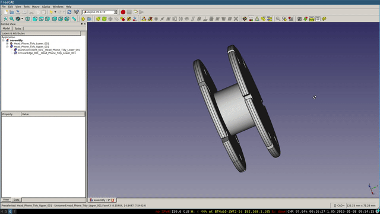

## Introduction

In this project, you will use 3D parametric modelling software to design a headphone tidy. If you have access to a 3D printer, you can print your model.

The model will be made of two parts that fit together.

### What you will make

--- no-print ---

--- /no-print ---

--- collapse ---
---
title: What you will need
---
### Hardware

+ A computer capable of running FreeCAD

### Software

+ [FreeCAD](https://www.freecadweb.org/)
+ Optional:
  + [Cura](https://ultimaker.com/en/resources/51943-installation-ultimaker-cura) if you need to export your model to a `.gcode` file
  + [Octopi](https://octoprint.org/download/) for managing your 3D printer

--- /collapse ---

--- collapse ---
---
title: What you will learn
---

+ How to create 3D models from sketches
+ How to fully constrain a sketch
+ How to use the polar pattern tool in FreeCAD

--- /collapse ---

--- collapse ---
---
title: Additional information for educators
---

If you need to print this project, please use the [printer-friendly version](https://projects.raspberrypi.org/en/projects/freecad-headphone-tidy/print){:target="_blank"}.

You can [find the solution for this project here](http://rpf.io/p/en/freecad-headphone-tidy-get){:target="_blank"}.

--- /collapse ---
