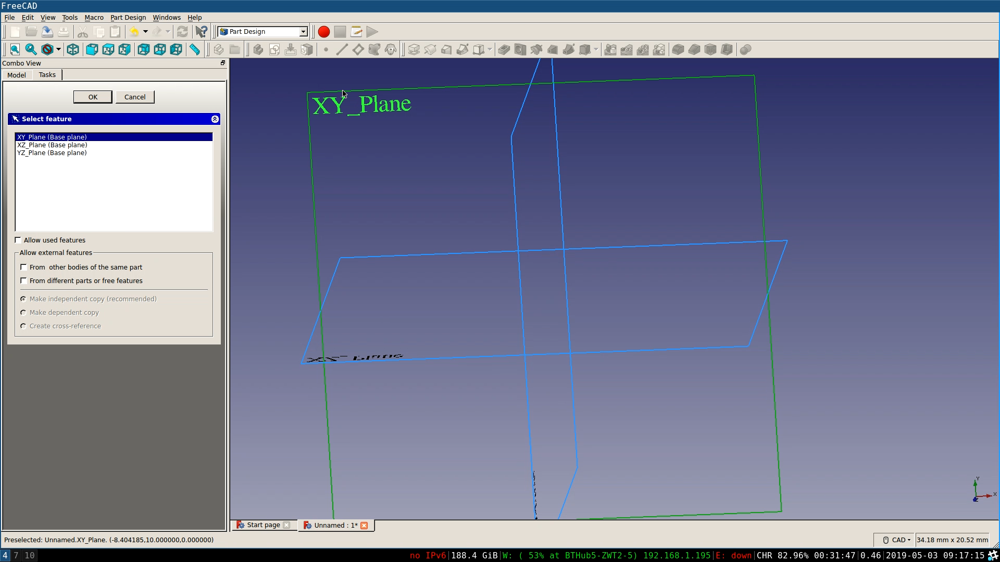

## The initial sketch

--- task ---
Open FreeCAD and create a new file. Save this as Headphone_Tidy_Lower.
--- /task ---

--- task ---
Open the **Part Design** menu and then create a **New Body** 

Then create a **New Sketch** 
--- /task ---

--- task ---
Select the **XY_Plane** to begin your sketch.

--- /task ---

--- task ---
Using the **Line Tool** 

draw the following shape. Don't worry about being too accurate at this stage.

--- /task ---

Now you have the basic shape you can *constrain* your sketch. When drawing sketches, FreeCAD will often intelligently apply constraints for you. This will happen if you accurately click on an existing point for instance. However, often you will have to investigate your sketch to see which points, lines and arcs need to be constrained.

--- task ---
Begin by clicking on each of the points and moving them around. In the image below you can see that two lines are unattached to the main shape.

--- /task ---

--- task ---
Click on a point you want to attach, then hold down **Ctrl** and click on the point it is to be attached to. Then using the **Constraint Concentric Tool**
 connect the points.

When you are finished all the points should be connected.

--- /task ---

--- task ---
Using the **Fillet Tool** 

click on pairs of lines where you want to place a fillet, so that your sketch looks like the one below.

--- /task ---

--- task ---
Finally you can use the remaining constraint tools, to fully constrain your sketch.
1. Lines should either be constrained vertically or horizontally
2. Fillets should have radial constraints
3. Lines should have verticle and horizontal lengths.

You can see a fully constrained sketch in the image below, with the dimensions shown.

--- /task ---

--- no-print ---
--- hints --- --- hint ---
Here's a video showing the complete sketch process.
<video width="640" height="360" controls>
<source src="images/lower_sketch_tut.webm" type="video/webm">
Your browser does not support WebM video, try FireFox or Chrome
</video>
--- /hint --- --- /hints ---
--- /no-print ---
