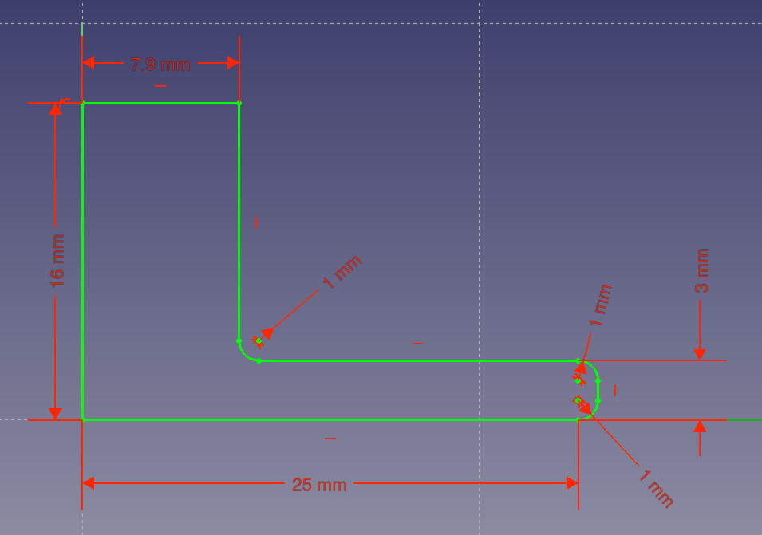

## The initial sketch

--- task ---
Open FreeCAD and create a new file. Save this as `Headphone_Tidy_Lower`.
--- /task ---

--- task ---
Open the **Part Design** menu, then click on the **New body** icon .

Next, click on the **New sketch** icon .
--- /task ---

--- task ---
Select the **XY_Plane**. This will allow you to to begin your sketch.

--- /task ---

--- task ---
Click on the **Line tool** icon . Use this tool to

draw the shape below. The drawing does not need to be completely accurate at this stage.

--- /task ---

Now that you have the basic shape, you can **constrain** your sketch. When drawing sketches, FreeCAD will often intelligently apply constraints for you (although on macOS, this can be buggy). It will do this if you accurately click on an existing point, for example. However, often you will have to investigate your sketch to see which points, lines, and arcs need to be constrained.

--- task ---
To begin with, click on each of the points and move them around. In the image below, you can see that two lines are unattached to the main shape.

--- /task ---

--- task ---
Click on a point that you want to attach, then hold down <kbd>Ctrl</kbd> and click on the point that it needs to be attached to. Then, to connect the points, click on the **Point constraint tool** icon
.

When you have finished, all of the points should be connected.

--- /task ---

--- task ---
Now, click on the **Fillet tool** icon

.

Click on pairs of lines where you want to place a fillet, so that your sketch looks like the one below.

--- /task ---

--- task ---
Finally, use the remaining constraint tools to fully constrain your sketch.
1. Lines should either be constrained vertically or horizontally
2. Fillets should have radial constraints
3. Lines should be vertical and horizontal

Your sketch should look like the fully constrained sketch in the image below. It should also have the dimensions shown in the image.

--- /task ---

--- no-print ---
--- hints --- --- hint ---
Here is a video that shows the complete sketch process:
<video width="640" height="360" controls>
<source src="images/lower_part_1.webm" type="video/webm">
Your browser does not support WebM video — try Firefox or Chrome.
</video>
--- /hint --- --- /hints ---
--- /no-print ---
