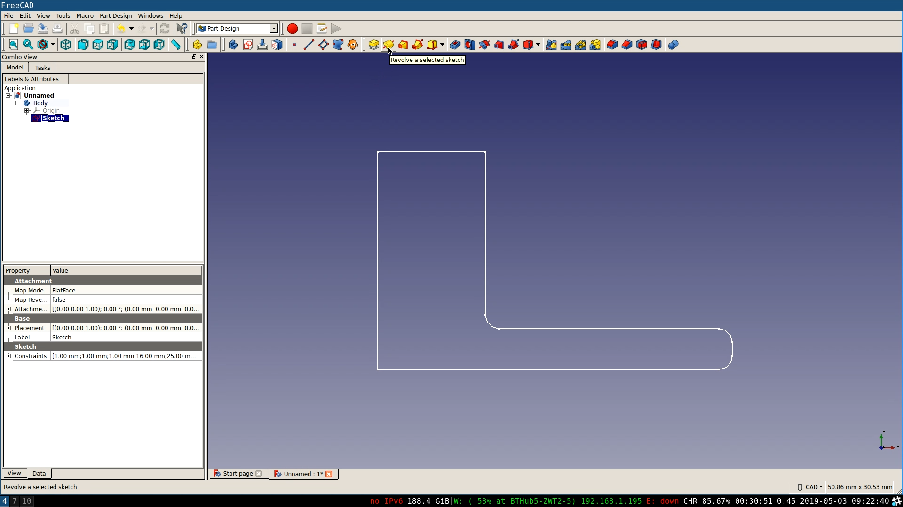
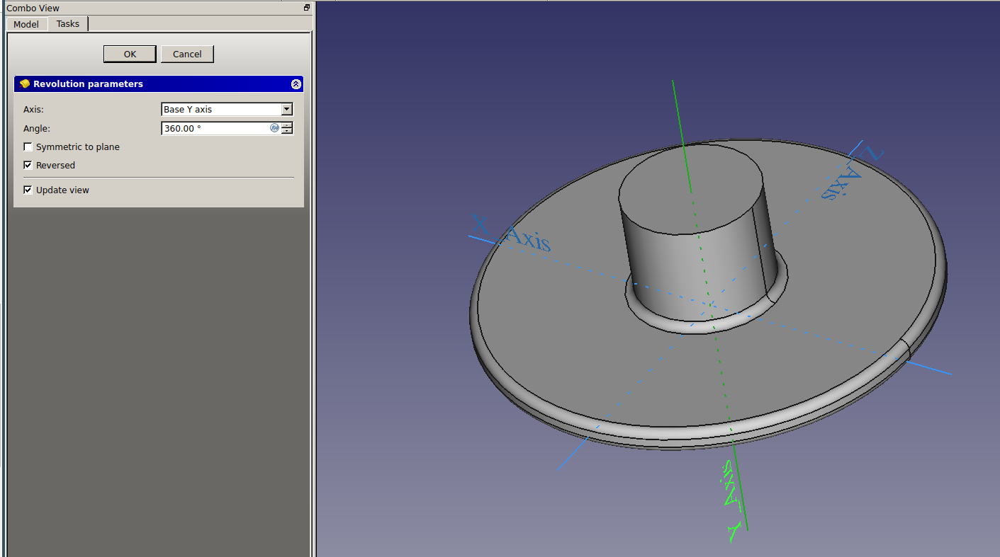

## Revolve the sketch

Now that you have a completed sketch you can use the **Revolution Tool** to turn it into a solid object.

--- task ---
Close your sketch, and then select it in the **Model Tab**
--- /task ---

--- task ---
Click on the **Revolution Tool** with the sketch selected.

--- /task ---

--- task ---
You will want to make sure that the **Base Y axis** is axis around which the sketch is being revolved, then click **OK**

--- /task ---

--- hints --- --- hint ---
Here is a video showing the complete process
<video width="640" height="360" controls>
<source src="images/lower_part_2.webm" type="video/webm">
Your browser does not support WebM video, try FireFox or Chrome
</video>

--- /hint --- --- /hints ---
