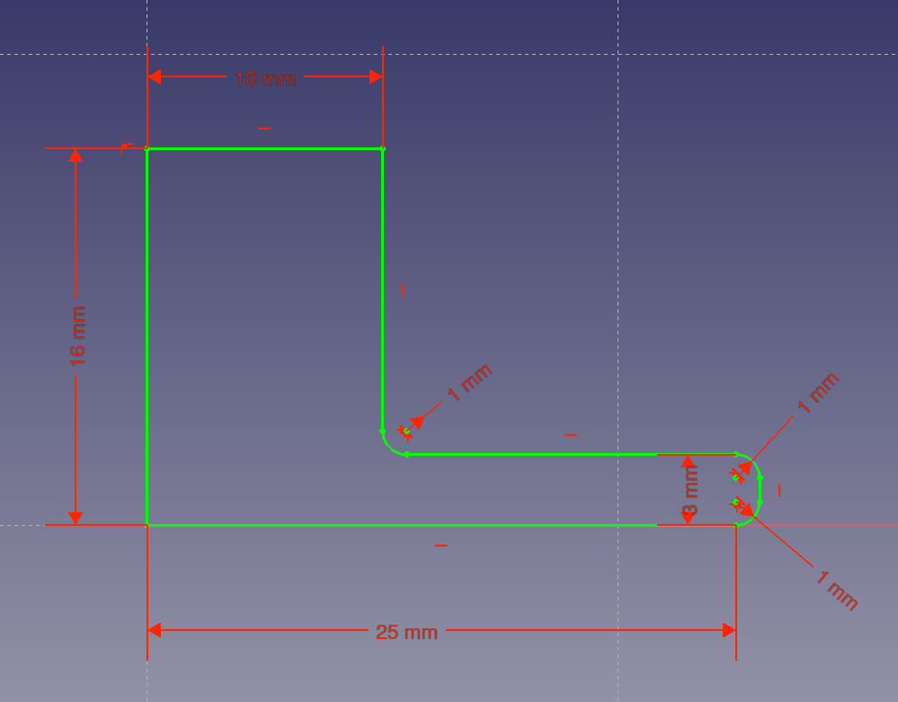
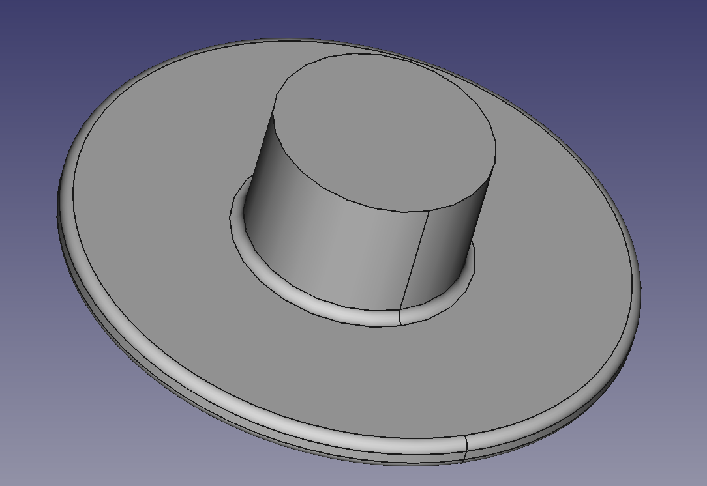

## Sketch and revolve the upper part

You have now made the basic structure of the lower piece of the headphone tidy. In this step, you will make the upper piece.

--- task ---
Repeat the previous two steps to create a new sketch with the dimensions shown in the diagram below, and then revolve it around the Y axis.

--- /task ---

--- hints --- --- hint ---
Here is a video showing the complete process:
<video width="640" height="360" controls>
<source src="images/upper_part_1.webm" type="video/webm">
Your browser does not support WebM video — try Firefox or Chrome.
</video>

--- /hint --- --- /hints ---
