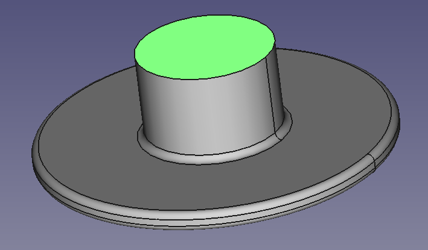
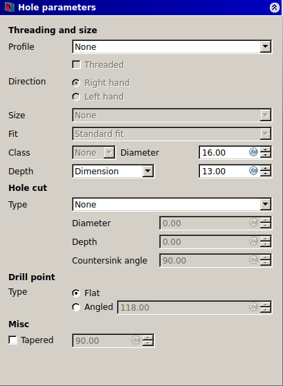
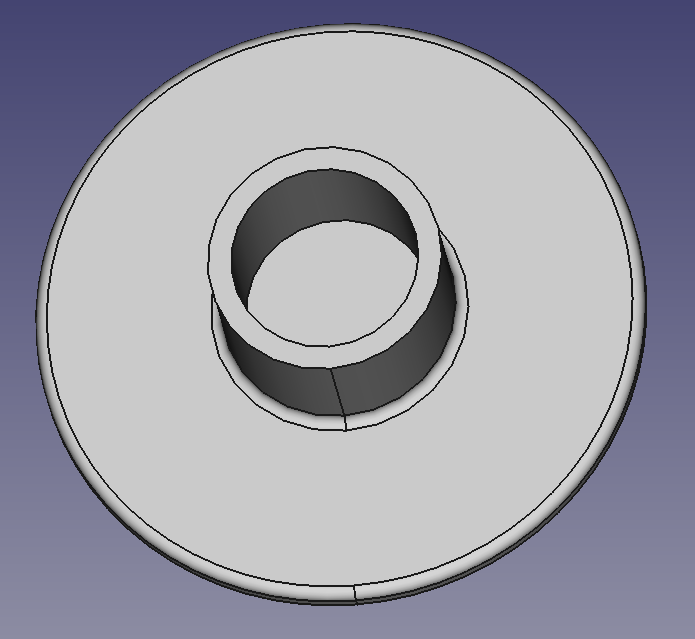

## Cut a hole

You need to cut a hole in the upper part of your headphone tidy so that the lower part can fit inside it.

--- task ---
Select the uppermost face of the model.

--- /task ---

--- task ---
Use the **Hole tool** to cut a hole in the face and open the **Hole parameters** menu.

--- /task ---

--- task ---
Set the hole **diameter** to `16mm`, the **depth** to `13mm`, and the **drill type** to `Flat`, then click on **OK**.

--- /task ---

--- hints --- --- hint ---
You can watch a video of the hole being made here:
<video width="640" height="360" controls>
<source src="images/upper_part_2.webm" type="video/webm">
Your browser does not support WebM video — try Firefox or Chrome.
</video>

--- /hint --- --- /hints ---
