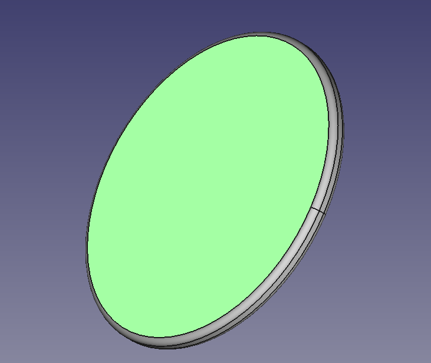
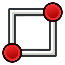
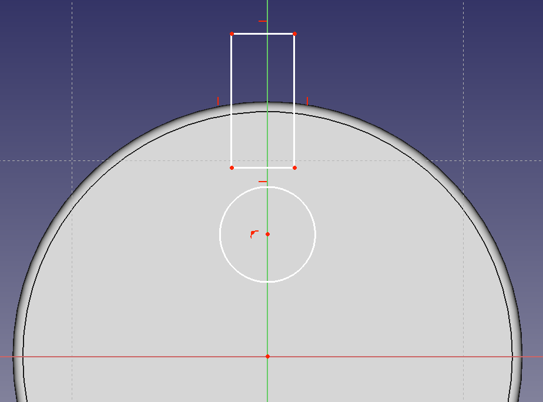
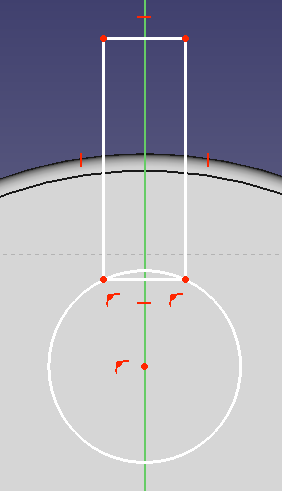
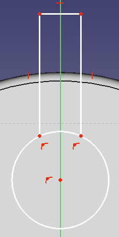
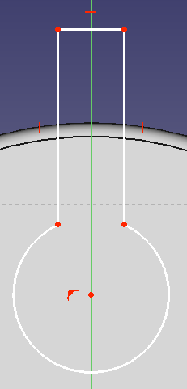
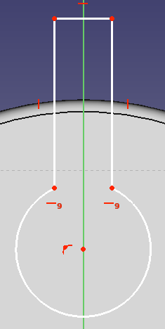
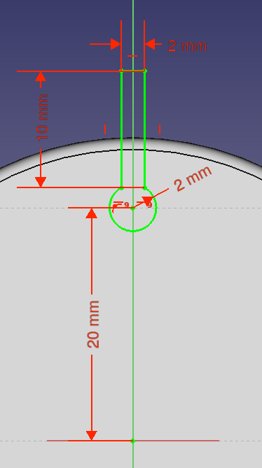

## Cable cutout sketch

Now that you have the basic structure for the headphone tidy, you need to cut holes into the upper and lower sections where the cable can be placed.

--- task ---
On either the upper or lower section of your model, select the large flat plane on the underside of the tidy.

--- /task ---

--- task ---
Click on the **New Sketch** icon, to start sketching on this surface,

--- /task ---

--- task ---
Create a circle and a rectangle on the surface of the tidy, using the **Create Circle** and **Create Rectangle** tools.

--- /task ---

--- task ---
Use the **Constrain Point on Object** tool to afix the lower two points of the rectangle to the circumference of the circle.

--- /task ---

--- task ---
You can select the lower line of the rectangle and then delete it using your **Delete** key (**Fn Backspace** on MacOS).

--- /task ---

--- task ---
Use the **Trimming** tool to remove the arc between the lower two points of the rectangle.

--- /task ---

--- task ---
The two uppermost points on the circle now need constraining, so that they are horizontal to each other.

--- /task ---

--- task ---
Lastly use the radius constraint and the horizontal and verticle lenght constraints to fully constrain the sketch, as shown below.

--- /task ---

--- task ---
With the sketch fully constrained you can close the sketch and return to your model.
--- /task ---
