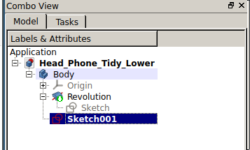
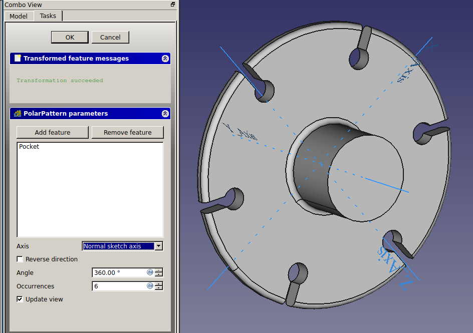

## Polar pockets

Now that you have the sketch for the cutout, you can create a pocket and repeat the pocket in a radial pattern.

--- task ---
Select your sketch and then click on the **Create Pocket** tool

Any length over 3mm will cut through your model.
--- /task ---

--- task ---
Select the pocket.

--- /task ---

--- task ---
Then click the **Polar Pattern** tool.

--- /task ---

--- task ---
Change the occurances to `6`

--- /task ---

Your lower section is now complete.
