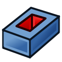

## Polar pockets

You now have the sketch for the cut-out. In this step, you will create a pocket and repeat the pocket in a radial pattern.

--- task ---
Select your sketch, then click on the **Create pocket** icon.

Any length over 3mm will cut through your model.
--- /task ---

--- task ---
Select the pocket.

--- /task ---

--- task ---
Then, click on the **Polar pattern tool** icon.

--- /task ---

--- task ---
Change the **occurrences** to `6`.

--- /task ---

--- task ---
You have now completed one part of your headphone tidy. Repeat those steps for the second part.
--- /task ---

--- hints --- --- hint ---
Here is a video that shows the complete process of creating the cut-outs.
<video width="640" height="360" controls>
<source src="images/cutouts.webm" type="video/webm">
Your browser does not support WebM video — try Firefox or Chrome.
</video>
--- /hint --- --- /hints ---

