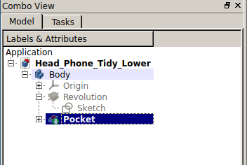

## Polar pockets

Now that you have the sketch for the cutout, you can create a pocket and repeat the pocket in a radial pattern.

--- task ---
Select your sketch and then click on the **Create Pocket** tool

Any length over 3mm will cut through your model.
--- /task ---

--- task ---
Select the pocket.

--- /task ---

--- task ---
Then click the **Polar Pattern** tool.

--- /task ---

--- task ---
Change the occurances to `6`

--- /task ---

--- task ---
One part of your headphone tidy is now complete. Repeate those steps for the second part.
--- /task ---

--- hints --- --- hint ---
Here's a video showing the complete process of creating the cutouts.
<video width="640" height="360" controls>
<source src="images/cutouts.webm" type="video/webm">
Your browser does not support WebM video, try FireFox or Chrome
</video>
--- /hint --- --- /hints ---

