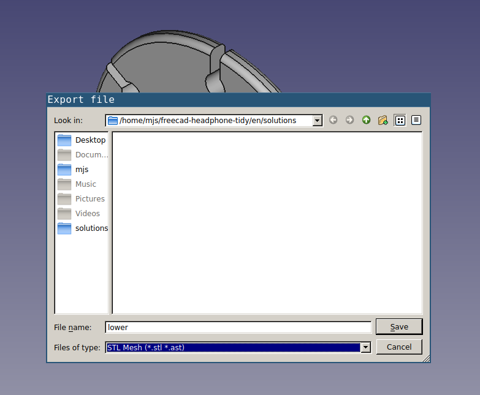
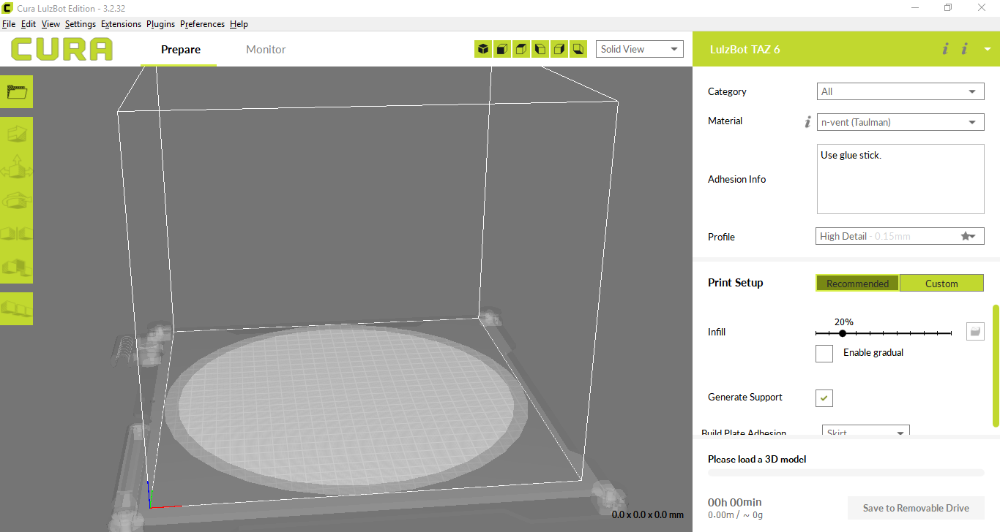
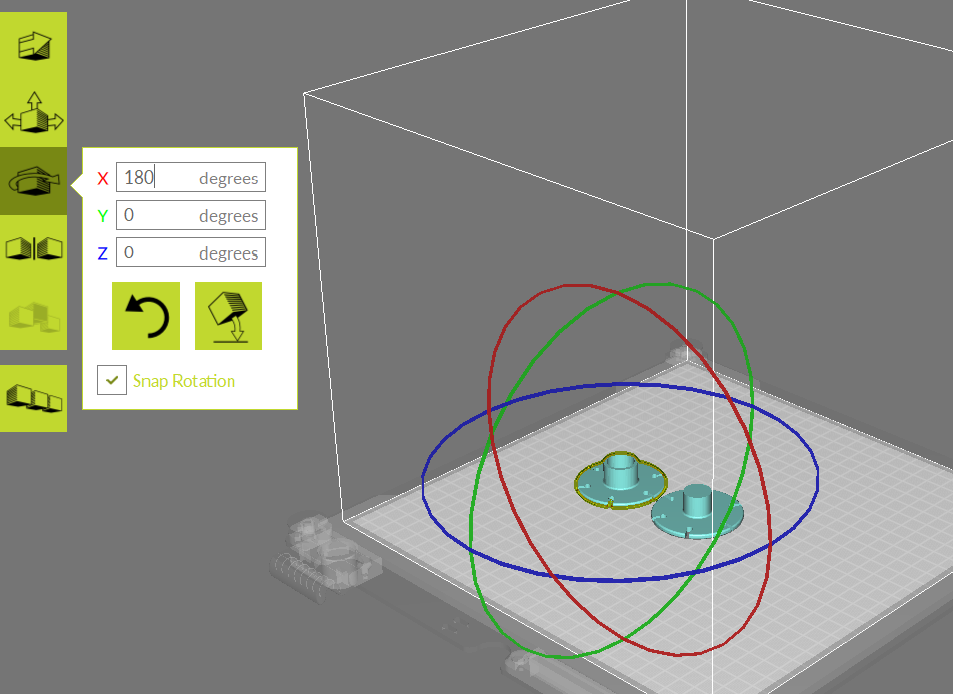
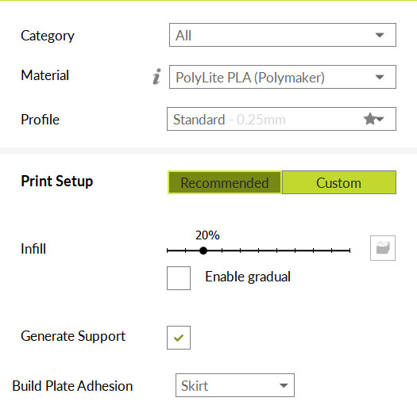

## Export your headphone tidy

In this step, you will export your model so that it can be printed. There are a lot of different types of 3D printer, but most of them will accept `.stl` files or `.gcode` files. It is easiest to export the model as an `.stl` file and then use an external program to convert this into a `.gcode` file.

--- task ---
Select the body in the **Model** tab. Click on **File**, then click on **Export**. In the **Files of type** drop-down menu, select the `.stl` option. Give your model a name, then click on **Save**.

--- /task ---

If your 3D printer requires `.gcode` files, use an external application to convert the `.stl` file into a `.gcode` file. The instructions below are for the software [Cura](https://ultimaker.com/en/products/ultimaker-cura-software).

--- task ---
Open Cura from your **Applications** menu.

--- /task ---

--- task ---
Go to the **File** menu and open your `upper.stl` and `lower.stl` files.
--- /task ---

--- task ---
Position the two models side by side and rotate them so that they lie flat on the bed.

--- /task ---

--- task ---
Use the settings on the right-hand side to choose your **material**, **profile**, **infill**, and any **support** you might need.
In this example:
+ The material is **PLA**
+ The profile is set to **Standard** detail 
+ The infill is set to **20%**

Once you are happy with the settings for your 3D printer, use the menu in the bottom left-hand corner to save your `.gcode` file.
--- /task ---
