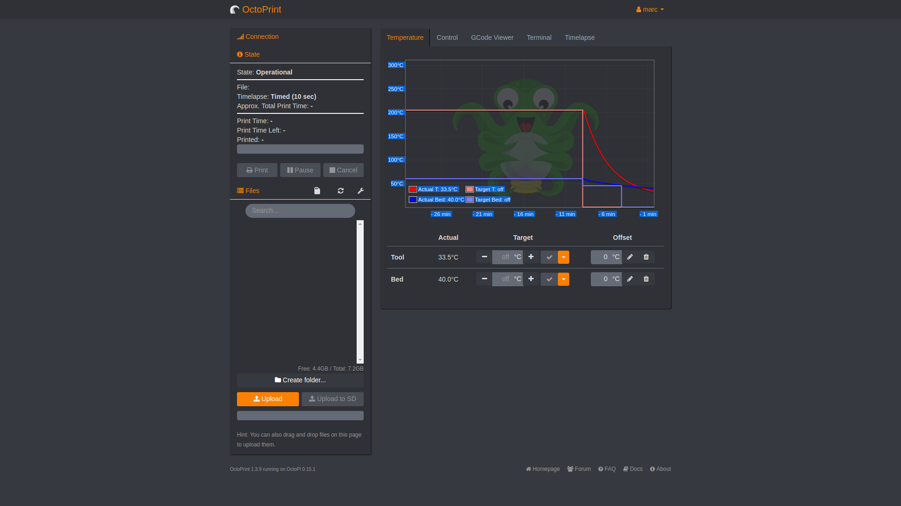
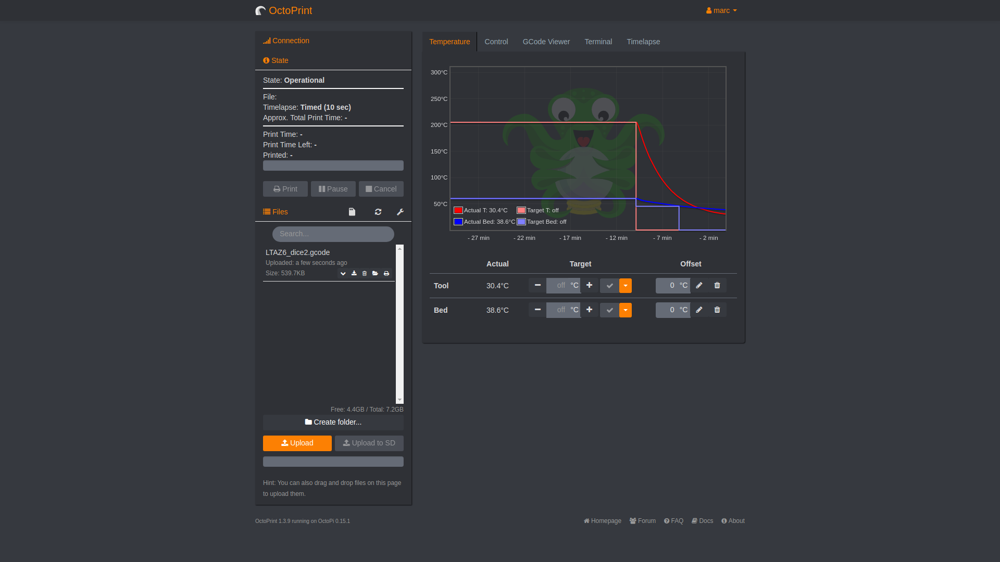

## Print the headphone tidy

Instructions can't be provided for all 3D printer models. The example here uses the [Octoprint](https://octoprint.org/) software to print the headphone tidy on a Lulzbot TAZ 6.

--- task ---
Turn on the 3D printer and load the Octoprint software.

--- /task ---

--- task ---
Load your `.gcode` file so that it appears in the file list.

--- /task ---

--- task ---
Then, load and print the file.

--- /task ---

As soon as the printer has warmed up, it should start printing the headphone tidy.

--- task ---
Push the upper and lower sections together. Your headphone tidy is now complete.

--- /task ---
